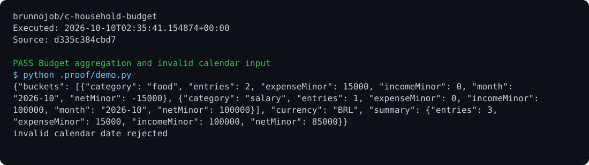

# Household Budget

Monthly income and expense totals by category, using integer cents and strict date and record validation.

## Run

Requirements: C17.

```sh
make
build/budget ledger.txt 2026-10 > result.json
```

## Behavior

Input format: `date|category|amount|description|income` or `expense`. A record without the fifth field is treated as an expense. Example: `2026-10-09|food|35.90|groceries|expense`. Invalid lines stop report generation.

## Optional report archive

Use the [native C operations archive client](https://github.com/brunnojob/vercel-home-telemetry-api/tree/main/clients/c) to queue `result.json` under project `c-household-budget`. The client uses `BRUNNODEV_ACCESS_TOKEN` and retains unacknowledged reports locally.

## License

Original source and documentation are MIT licensed; see [LICENSE](LICENSE). Third-party dependencies and media retain their respective terms. Maintained by [Brunno Dev](https://brunnodev.store).

## Implementation update

Reports include an integer-cent summary with income, expense, net and entry count for the selected month or complete ledger. Aggregated totals are checked for overflow before any JSON is emitted.

Contribution trailer: `Co-authored-by: nyctophile <329826984+ineedfoundmyway@users.noreply.github.com>`.

## Execution proof

[](https://github.com/brunnojob/c-household-budget/actions/workflows/proof.yml)



[Verified run](https://github.com/brunnojob/c-household-budget/actions/runs/38018024042) · [Execution report](docs/proof/evidence.json)

Run `python .proof/record.py` after installing the prerequisites above. The scenarios execute repository code and verify exit codes and expected output. CI publishes `execution-proof` with the transcript, input fingerprints and source commit. The downloadable report identifies the exact tested version; the workflow badge tracks the latest run.
